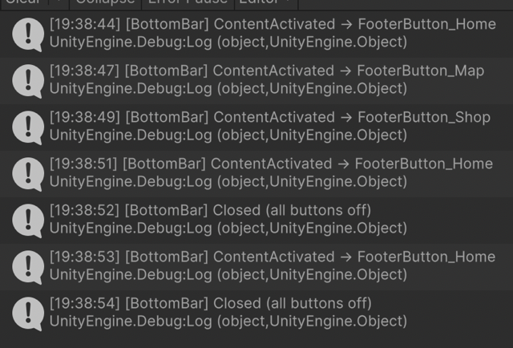
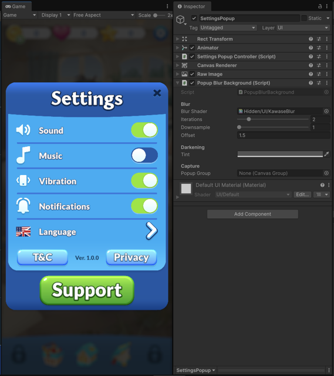
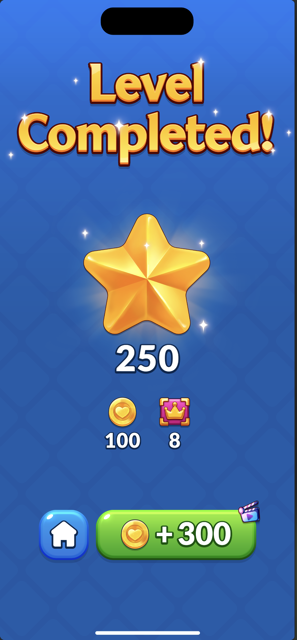
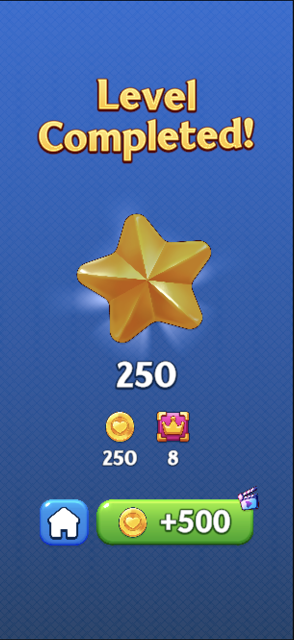
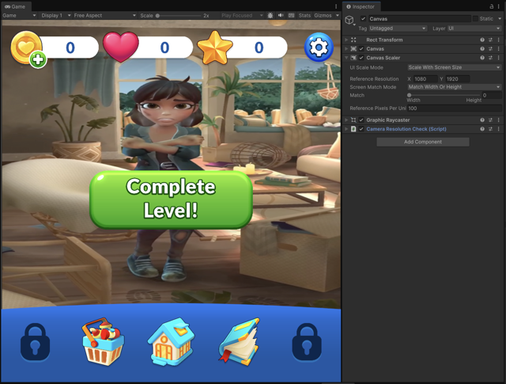
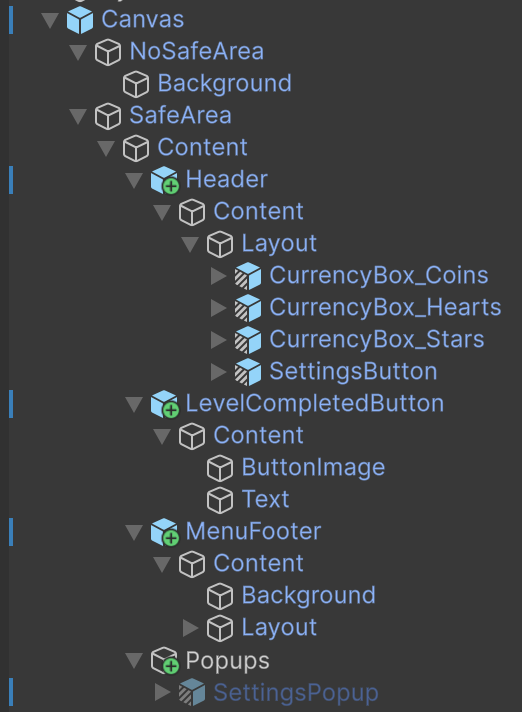
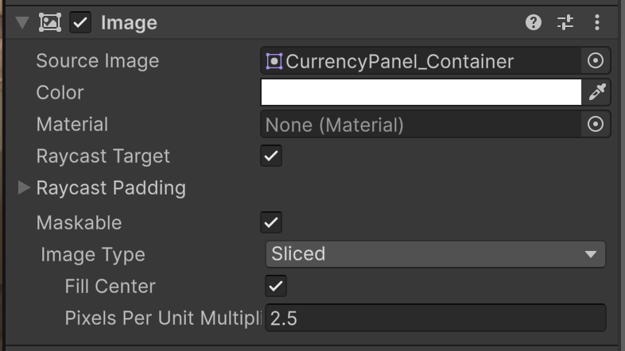
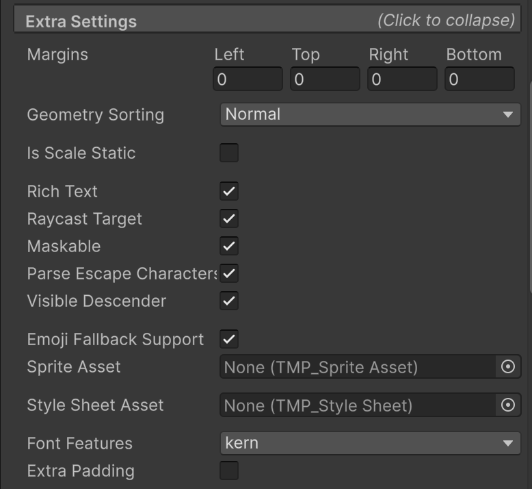
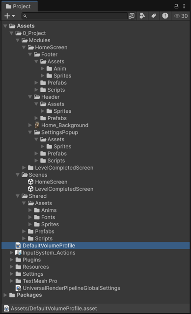

# Tech-Art Review - LTAA Unity Project

**Reviewer:** Jerome Dassy · Lead Tech Art

**Date:** 28 june 2026

**Unity:** 6 (`6000.0.78f1`)

**Assuming** `main` is the PR under review in this context.

A couple of points below are tagged *(assumption)*, those are my reading of intent, worth a quick confirm before acting.

---

Nice work getting this together. The foundation is solid; below are a few places where the build drifts from the brief, so they're easy to act on. I've also made some of the changes already so you can see the intent in code rather than just words. Take it as a to-do you can pick at, not a list of mistakes.

---

## The Core

Good foundation: a clean `Modules` / `Shared` split, URP in linear colour, TextMesh Pro and DOTween already in place, working animators, and a Level Completed screen that looks great. The things worth your attention are few, mostly around responsiveness and a couple of brief items.

---

## Where it drifts from the brief

Grouped by the brief's own tasks, so it maps cleanly to what you've built.

### Task 1 · Home Screen & Bottom Bar
- The brief asks for a **`BottomBarView` that fires `ContentActivated` / `Closed`**. That wasn't in yet, so I added one as a reference, event-driven and configurable from the Inspector.
- The selection **indicator looked like its animation was broken** , this one's subtle and not obvious: the selected button animates its *width*, which makes the layout group re-flow all the buttons, so the indicator was moving to a spot the button had already left. *(Done, it now follows the button's live position as the layout settles.)*

Event proof from Play Mode:



### Task 2 · Settings Popup
- The brief mentions darkening **and blur**,  the blur part wasn't there yet.
- The Settings popup is built on its own rather than from a shared **base popup**. A single base (open / idle / close + dim + blur) that other popups inherit will make the next popup almost free to build.
- **Localization** isn't wired yet,  the text is set directly. I'd scaffold this with the official **Unity Localization** package now, using String Tables and `LocalizeStringEvent` / `LocalizedString` bindings on TMP labels. It's cheap now and noticeably more work to retrofit once there's lots of copy. *(Assuming there isn't already a conventional localization plugin).*

Small example:

```csharp
[SerializeField] private LocalizedString title;
[SerializeField] private TMP_Text label;

private void OnEnable() => title.StringChanged += ApplyTitle;
private void OnDisable() => title.StringChanged -= ApplyTitle;
private void ApplyTitle(string value) => label.text = value;
```

Blur pass add as a reusable popup backdrop:



### Task 3 · Level Completed
- One structural note: it's reached by a **hard scene load**, so the "striking opening transition" can't carry across the scene boundary. Loading it as an additive / overlay screen would let a transition actually play. *((assumption) Or as part of the HomeScreen canvas if there no other scenes, or need for scene switching).*
- The top bar (coins / hearts / stars / settings) **isn't anchored to the screen edges**,  on wider ratios it drifts toward the centre. *(assumption: the intent is to pin those to the top corners so they hug the edges on any device.)*
- The **background tiling doesn't match the target**. The current version is much finer and more contrasty, so it reads as a noisy grid behind the reward. The target has larger, softer, lower-contrast tiles.

Target tiling:



Current tiling:



Suggested fix: expose the background material's tile scale / pattern opacity, then tune it against the reference at the same aspect ratio.

### Responsiveness,  the one I'd look at first
The brief leans on responsiveness, and this is where the project needs the most love:

- **The current scaler inflates the UI on larger ratios.** *Scale With Screen Size* (1080×1920) with **Match = Width** (the original setting) scales by `screenWidth / 1080`, so on wider/larger screens
  everything balloons past the frame. Two candidate fixes,  which one fits depends on the per-screen-size mockups the art team provides:
  - **Expand** (Scale With Screen Size → *Expand*): scales by the **smaller** ratio, so the composition always stays fully visible and never inflates (it may letterbox / leave margins). Still adapts to resolution automatically.
  - **Constant Pixel Size** (fixed Scale Factor): the UI holds a **fixed pixel size** regardless of screen, never inflates, but it doesn't scale with resolution, so it reads larger on small screens and smaller on big / high-density ones. Best only when the art is authored per density / size.

  This is exactly what the note to the artist is asking for,  the mockups decide it. Two things to settle alongside: confirm whether **landscape is even a target** (the app auto-rotates with landscape on, `defaultScreenOrientation: 4`, though the art is portrait); and `CameraResolutionCheck` flips *Match* by device class at runtime, which a single deliberate choice makes unnecessary.
- **Reward VFX won't scale with the UI.** `StarBurst_Small` and `MainReward` particle systems use **Scaling Mode = Local**, so they ignore the Canvas scale,  the burst will be the wrong size on tablets or other scale factors. Switching them to **Hierarchy** ties them to the responsive layout.
- A couple of scripts (safe-area, the wavy title text) poll every frame in `Update()` rather than reacting to change,  fine for now, worth making event-driven later. *(Wavy-text done.)* Also worth confirming the header and footer actually sit under the `SafeArea` node (not its `NoSafeArea` sibling), so notches and the home bar are respected.

Scaler / hierarchy captures:

 



### Small clean-up
- The **Canvas render mode** is *Screen Space – Camera* but no camera is assigned, so it quietly falls back to overlay behaviour. Worth setting it to *Overlay* on purpose (or wiring the camera) so it's intentional.
- **Decorative images and texts have *Raycast Target* on**. Turning it off on graphics that aren't clickable trims needless UI raycasting, a quick, free win.
- Naming drifts between conventions (`currencyBox` vs `CurrencyBox_*`, `menu_footer`). Picking one keeps the project easy to scan as it grows.

Examples:





### Performance
- **No SpriteAtlas.** Around 45 UI sprites import individually, so they can't batch into a single draw call. Grouping each icon set into an atlas cuts draw calls and tightens memory, the footer and header icons being the obvious first candidates.
- **Reward shader cost is probably okay, but worth profiling.** `ShinyStar` and `GlowRays` look bigger in the Project window than they really are at runtime: `ShinyStar` has one texture sample plus a bit of animated/noise math, and `GlowRays` is mostly procedural polar/rotate math. I wouldn't call these a blocker. The thing to watch is fill-rate / overdraw, especially the 800×800 rays quad behind the star.
- *(assumption)* **`Home_Background.png` looks like placeholder art.** If it ships as-is it's over-resolution for its on-screen size. Flagging it to confirm rather than counting it as a real issue, worth right-sizing once the final art lands.

### Project structure, settings & hierarchy
- **Scene setup is duplicated.** Each scene carries its own Camera, EventSystem and `Systems` container, and the `Systems` pattern is only half-applied. A small persistent / bootstrap scene holding those (loaded once) removes the duplication and the per-scene rewiring.
- **Custom tags, layers, sorting layers.** There are no custom tags / layers / sorting layers. Quick to set, and sorting layers in particular keep UI and VFX draw order intentional.
- *(assumption)* **Folder layout may be a studio convention,** so treat this as a suggestion. The `Modules` / `Shared` split is a good instinct, but it's a little inconsistent inside (for example `Anim` vs `Anims`, sprites split unevenly). A consistent per-feature shape, each module with `Scripts/`, `Prefabs/`, `Art/{Sprites,Anims,Materials}`, plus a `Shared/Core` for cross-feature code, would keep it easy to scan as it grows.

Project layout reference:



### Code notes (beyond the deep-dive)
The refactor below shows the target; the same small patterns recur elsewhere and are worth a quick sweep: magic strings for animator parameters, a few missing namespaces, a hidden DOTween dependency, and string-based scene loads. None are urgent, but tidying them keeps the codebase consistent.

---

## What I changed (so the bar is concrete, not abstract)

All on the review branches, small and verified in Play mode:

- **Bottom bar** → `BottomBarView` + `BottomBarButton`: the two brief events, hashed animator params, Inspector-exposed timings, and the live-following indicator described above.
- **Popup blur** → a reusable `KawaseBlur` shader + `PopupBlurBackground` you can drop on any popup.
- **Three fixes** → wavy-text performance (no per-frame mesh rebuild), scene-load validation, and a magic-string animator param turned into a cached hash.

Commit trail, for the review history:

- `b6fa7f5` → Bottom bar refactor.
- `86c6b60` → demo listener to prove the two events in Play mode.
- `69a7f6b` → small correctness / performance fixes.
- `9ccac6d` → reusable popup blur.
- `40e6877` → responsive-layout example pass.

One small before / after,  the rest live in the commit history:

```csharp
// before,  re-hashes the string every call, and a typo fails silently
animator.SetBool("Selected", value);

// after,  hashed once, one source of truth
static readonly int Selected = Animator.StringToHash("Selected");
animator.SetBool(Selected, value);
```

One shader-side example, for the popup blur:

```hlsl
// cheap 4-tap Kawase blur pass on a downsampled snapshot, not a live full-res blur
fixed4 col  = tex2D(_MainTex, i.uv + float2( o.x,  o.y));
col        += tex2D(_MainTex, i.uv + float2(-o.x,  o.y));
col        += tex2D(_MainTex, i.uv + float2( o.x, -o.y));
col        += tex2D(_MainTex, i.uv + float2(-o.x, -o.y));
return col * 0.25;
```

Why it's better: it gives future popups the same frosted backdrop, but keeps the cost tunable through downsample, iterations and tint instead of asking each popup to invent its own blur.

---

## A note for the reference artist

The brief asks us to make the UI **responsive**, to adapt across phones, tablets and device safe areas. The references (PSD + GIF) define *one* layout beautifully, but they don't show how it should **reflow on other screen ratios**: which elements pin to the edges, which scale, and how much breathing room to keep on very tall or very wide screens.

That leaves the responsive behaviour as guesswork on our side. If you could share intended layouts for two target ratios (a tall phone and a tablet), or simply mark which elements anchor to edges versus scale with the screen, the responsive pass stays true to your design instead of us inventing it. No new art needed,  just the intent.

---

## What this means per discipline

- **Artists / Tech-Art:** the responsive mockups (see the note above) unblock the scaler choice; sprite atlases are the main pipeline win, and reward shader cost should just be checked once on target device.
- **Engineers:** treat the `BottomBarView` pattern (C# events + serialized config, hashed params, balanced listeners) as the template for UI components; move shared systems into a bootstrap scene and swap string scene-loads for a typed router.
- **Production:** the genuine brief gaps are bottom-bar events (done), blur (done), the base popup, and localization. Suggested order: responsiveness + perf quick-wins first, then base popup + localization before more content lands.

## Priority snapshot

Severity (P0 brief-required → P3 polish) · user/production impact · effort:

- **Responsiveness scaler** (landscape balloon): P1 · high · S *(done as example)*
- **`BottomBarView` events**: P0 · high · M *(done)*
- **Popup blur**: P0 · medium · M *(done)*
- **Base popup + localization**: P1 · high (future cost) · M
- **Top-bar anchoring**: P2 · medium · S
- **SpriteAtlas + reward overdraw check**: P2 · medium · M
- **Naming · project settings · Raycast cleanup**: P3 · low · S

## If you pick up only three things next

1. **Settle the responsive approach with the art team**,  swap the ballooning *Match = Width* for *Expand* or *Constant Pixel Size* per their per-size mockups, and confirm whether landscape is a target at all.
2. **Make Settings a variant of one base popup**, so dim / blur / animations come for free.
3. **Scaffold localization** before more copy lands.
